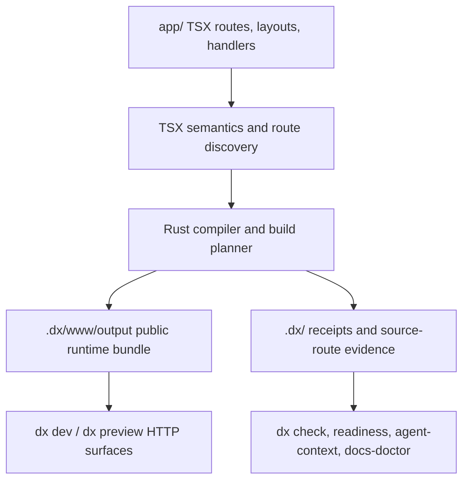
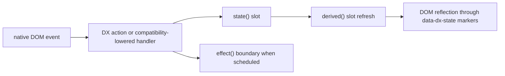
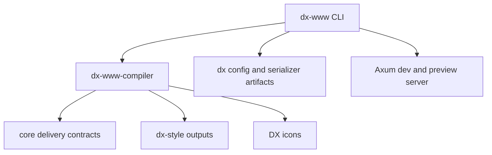
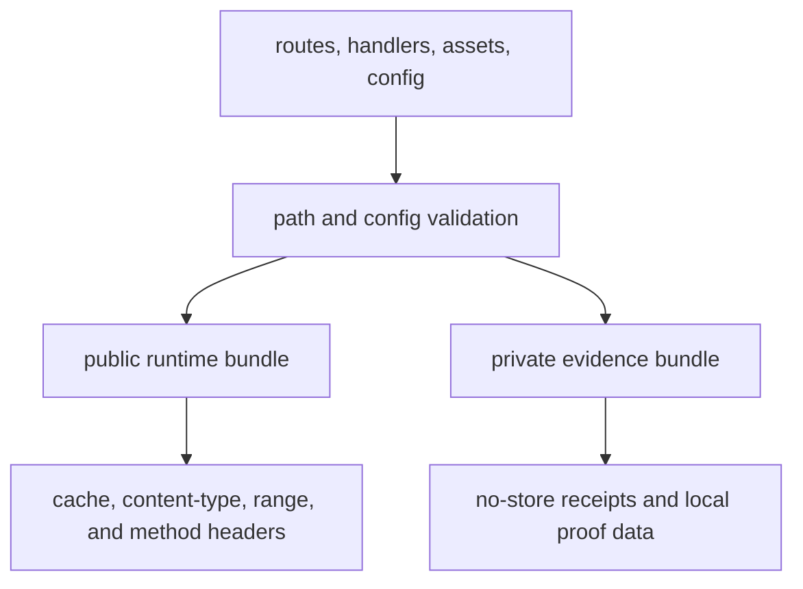

# dx-www Architecture

This document describes the current dx-www architecture: App Router-shaped TSX
authoring, Rust-owned build/dev/check tooling, source-owned route output,
dx-style generated CSS, DX icon/import tooling, and machine-readable receipts.

The public framework contract is not the old routing story. Packet and
compiler-object experiments still exist in compatibility modules and tests, but
new WWW starter apps should be described through the `app/` route tree,
extensionless `dx` config, `.dx/*` receipts, and generated static/runtime
artifacts.

## Overview

dx-www takes React-familiar TSX source, route handlers, style inputs, public
assets, and framework config, then produces route output, server-data, manifests,
dev/runtime metadata, and receipts. Runtime behavior is browser-native and
source-owned rather than a full React or Next.js runtime clone.

## System Architecture



## Compilation Pipeline

The compilation pipeline transforms TSX source through these stages:

1. Discover `app/` routes, route handlers, layouts, styles, imports, and public assets.
2. Parse React-shaped TSX into bounded WWW route semantics.
3. Lower static routes to HTML and CSS, and lower interactive routes to source-owned micro runtime units.
4. Write deployable public files under `.dx/www/output`.
5. Write evidence receipts, source maps, route units, and proof metadata under `.dx/`.

## Runtime And Wire Formats

Generated HTML/CSS and JSON-compatible manifests are the current browser-facing
default. Packet and binary object formats are tracked separately in
`docs/wire-format-audit.md` so internal experiments do not get mistaken for the
public WWW app contract.


## Request Flow

How a browser request flows through the system:

1. `dx dev` or production preview receives the request.
2. The route table resolves the App Router path and route-handler method.
3. Static assets are served from the public runtime bundle with cache and range policy.
4. Route handlers and server actions use structured request/response contracts.
5. Dev-only surfaces add hot reload, diagnostics, and devtools endpoints outside production output.


## State Update Flow

How state changes propagate to the DOM:




## Crate Dependencies




## Security Model




## Performance Characteristics


+--------+---------+-------+
| Metric | Value   | Notes |
+========+=========+=======+
| Full   | payload | ~10   |
+--------+---------+-------+


## Directory Structure

```text
dx-www/
├── src/
│   ├── build/                 # build output contracts and binary helpers
│   ├── cli/                   # commands, dev server, preview, checks, proof graph
│   ├── config.rs              # extensionless dx and legacy config loading
│   └── lib.rs
├── examples/
│   └── template/              # current minimal app/ starter surface
├── docs/
│   ├── architecture.md
│   └── getting-started.md
└── benchmarks/                # focused TypeScript contract tests
```

The most active framework runtime and command surfaces currently live under
`dx-www/src/cli`, while compiler-owned delivery contracts live under `core/src/delivery`.
